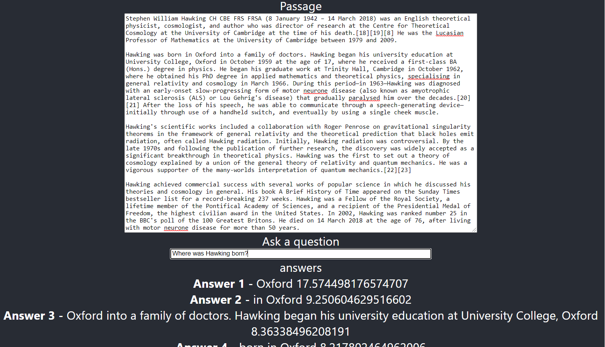

# BERT with Tensorflow.js and React.js

from : https://www.youtube.com/watch?v=IO1tjm9gcIs

## Getting Started with Create React App

This project was bootstrapped with [Create React App](https://github.com/facebook/create-react-app).

## Dependencies

npm install 
> @tensorflow/tfjs 
> @tensorflow-models/qna 
> react-loader-spinner

## to run

npm start

