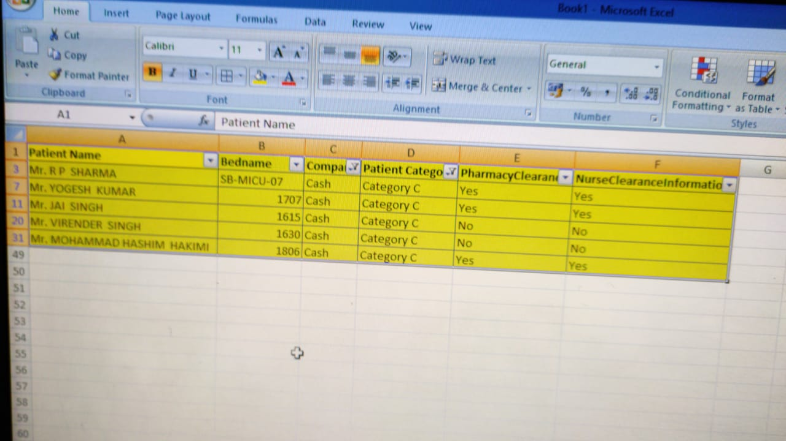

# cnn_binary_image_classifier
CNN Binary Image Classifier using Tensorflow

Video Tutorial : https://youtu.be/91o5XK_6PXU

I adapted the tutorial to sort images into various directories.

I have not added the training and testing directories though.

Example of a ham image

Example of a spam image
 