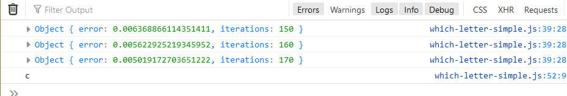

# detecting background color through machine learning

I still am not able to understand the regex function in javascript.

For predicting color -

for predicting the character -
which letter it is -
