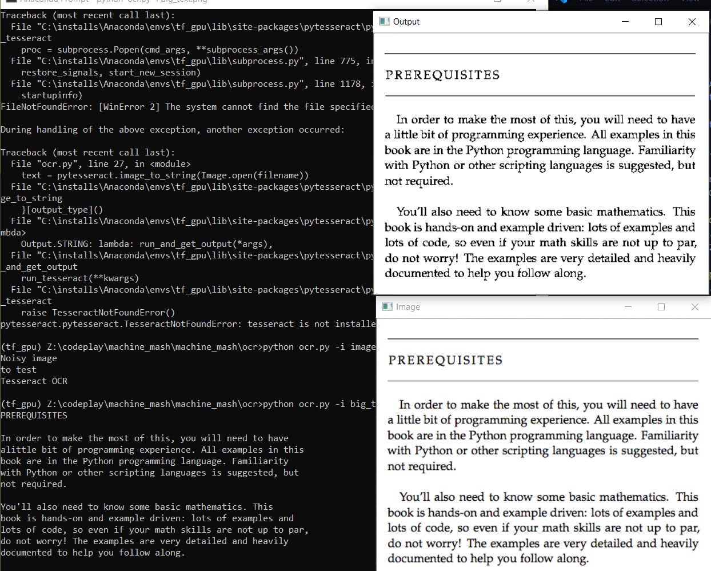
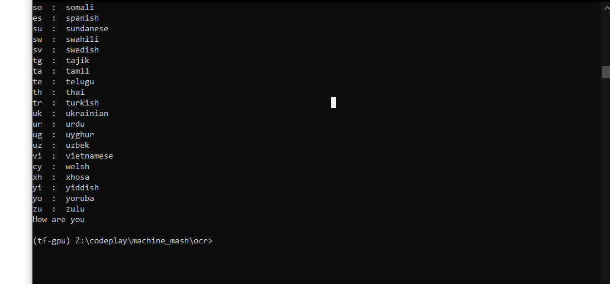
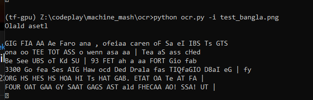
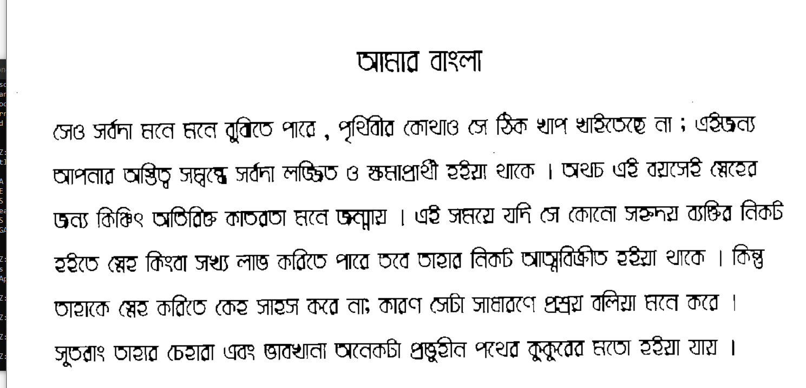
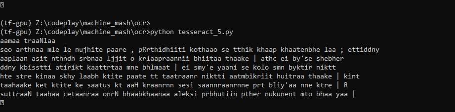
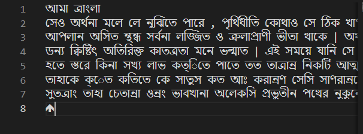
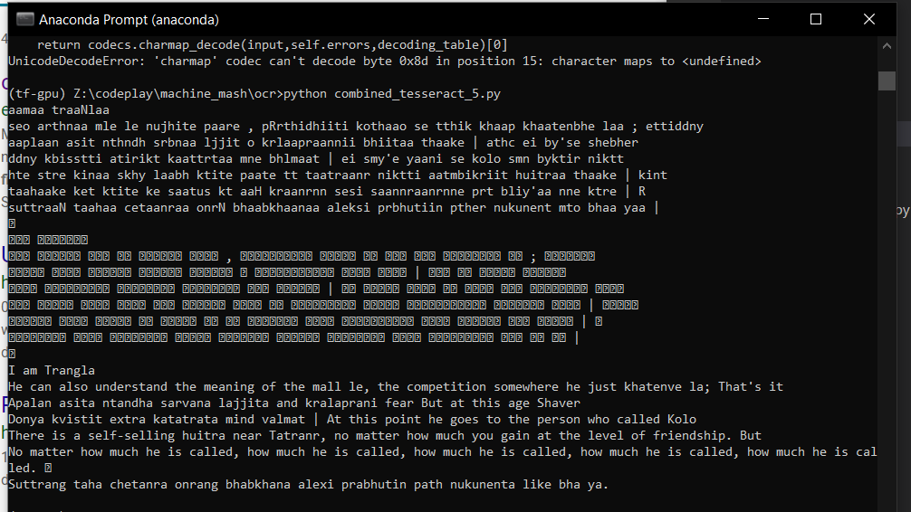

# OCR application

IMportant: 
https://support.microsoft.com/en-us/windows/language-packs-for-windows-a5094319-a92d-18de-5b53-1cfc697cfca8#:~:text=Windows%208.1%20%20%20%20Language%20%20,%20Control%20Panel%20%2013%20more%20rows

download language pack first for your OS

## Initially using tesseract.

## Other Tools to leverage for ocr

1. OCRopus - https://github.com/ocropus/ocropy

1. Ocular - https://github.com/tberg12/ocular

1. https://medium.com/better-programming/beginners-guide-to-tesseract-ocr-using-python-10ecbb426c3d

## google translate

It is working well with python

## Tesseract 5

from : https://nanonets.com/blog/ocr-with-tesseract/

Tesseract 4.00 includes a new neural network subsystem configured as a text line recognizer. It has its origins in OCRopus' Python-based LSTM implementation but has been redesigned for Tesseract in C++. The neural network system in Tesseract pre-dates TensorFlow but is compatible with it, as there is a network description language called Variable Graph Specification Language (VGSL), that is also available for TensorFlow.

To recognize an image containing a single character, we typically use a Convolutional Neural Network (CNN). Text of arbitrary length is a sequence of characters, and such problems are solved using RNNs and LSTM is a popular form of RNN. Read this post to learn more about LSTM.

LSTMs are great at learning sequences but slow down a lot when the number of states is too large. There are empirical results that suggest it is better to ask an LSTM to learn a long sequence than a short sequence of many classes. Tesseract developed from OCRopus model in Python which was a fork of a LSMT in C++, called CLSTM. CLSTM is an implementation of the LSTM recurrent neural network model in C++, using the Eigen library for numerical computations.

The only language pack installed in macOS Tesseract is English, which is contained in the eng.traineddata file.

So what are these Tesseract files?

eng.traineddata is the language pack for English.
osd.traineddata is a special data file related to orientation and scripts.
snum.traineddata is an internal serial number used by Tesseract.
pdf.ttf is a True Type Format Font file to support pdf renderings.

Got bengali text:

TODO:

1. make pytesseract work

tesseract documentation:

https://github.com/tesseract-ocr/tesseract/blob/master/doc/tesseract.1.asc

tessseract sorted!

bengali translation done

get boxes around text

https://www.pyimagesearch.com/2020/08/03/tesseract-ocr-for-non-english-languages/