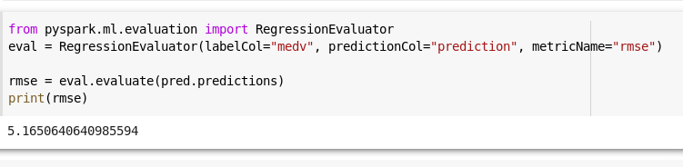

- here are three ways of Spark deployment as explained below.

    Standalone − Spark Standalone deployment means Spark occupies the place on top of HDFS(Hadoop Distributed File System) and space is allocated for HDFS, explicitly. Here, Spark and MapReduce will run side by side to cover all spark jobs on cluster.

    Hadoop Yarn − Hadoop Yarn deployment means, simply, spark runs on Yarn without any pre-installation or root access required. It helps to integrate Spark into Hadoop ecosystem or Hadoop stack. It allows other components to run on top of stack.

    Spark in MapReduce (SIMR) − Spark in MapReduce is used to launch spark job in addition to standalone deployment. With SIMR, user can start Spark and uses its shell without any administrative access.

- Resilient Distributed Datasets (RDD) is a fundamental data structure of Spark.

- Data on disk moves to multiple memory location and then is processed through multipleueries

# Working in colab

