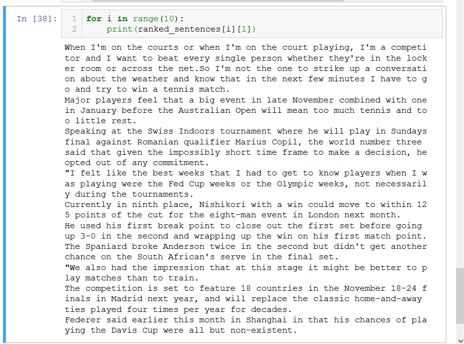
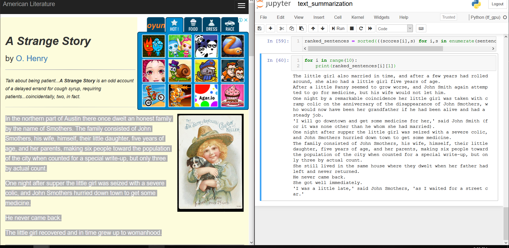
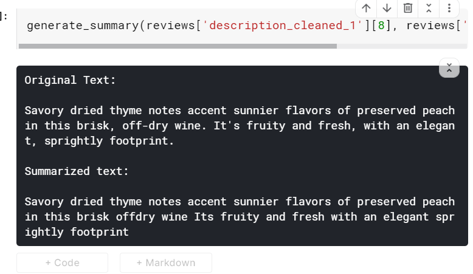

# Textrank for summarization

Tutorial source :
https://www.analyticsvidhya.com/blog/2018/11/introduction-text-summarization-textrank-python/

to do :
    creating a pipeline for new sentences

The dataset can be downloaded from:
https://nlp.stanford.edu/data/glove.6B.zip

Summarizing a O.Henry story

## Text summarization using spacy

https://www.kaggle.com/fanbyprinciple/wine-summarisation-using-spacy

But not quite upto the mark:

