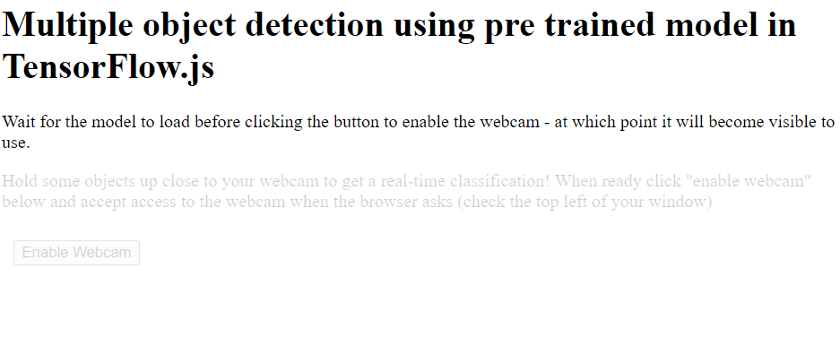

### Following codelabs tutorial on machine learning

https://codelabs.developers.google.com/codelabs/tensorflowjs-object-detection#1

Tensorflowjs incorporates use of webGL to enable execution on device's graphic card(GPU)

We will be using COCO-SSD for this

COCO - Common object in context dataset - Dateset

SSD - Single shot multibox detection - Architecture

Its incomplete.

